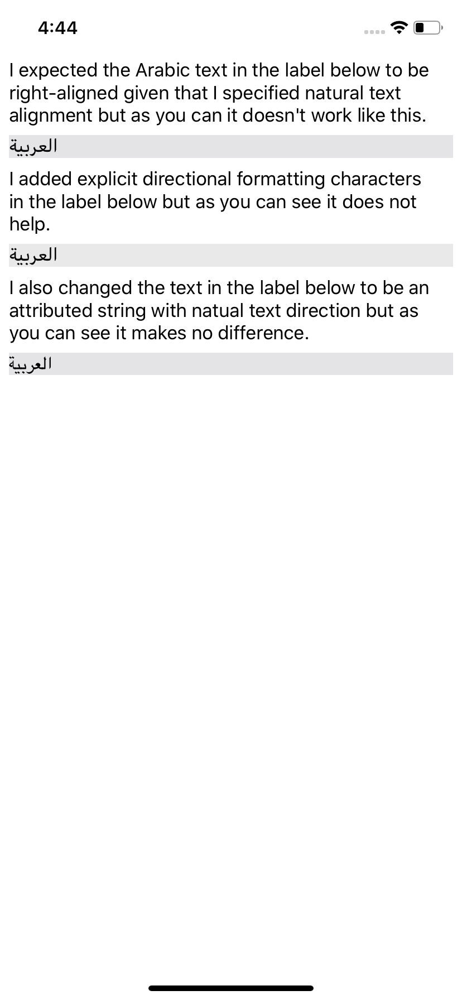

This repository contains a simple iOS application which demonstrates the problem of Arabic (i.e. right-to-left) text not right-aligning within `UILabel` objects which have a [textAlignment](https://developer.apple.com/documentation/uikit/uilabel/1620541-textalignment) value of [NSTextAlignment.natural](https://developer.apple.com/documentation/uikit/nstextalignment/natural).

The screenshot below demonstrates what you'll see if you run the application on an iOS 13 device.

