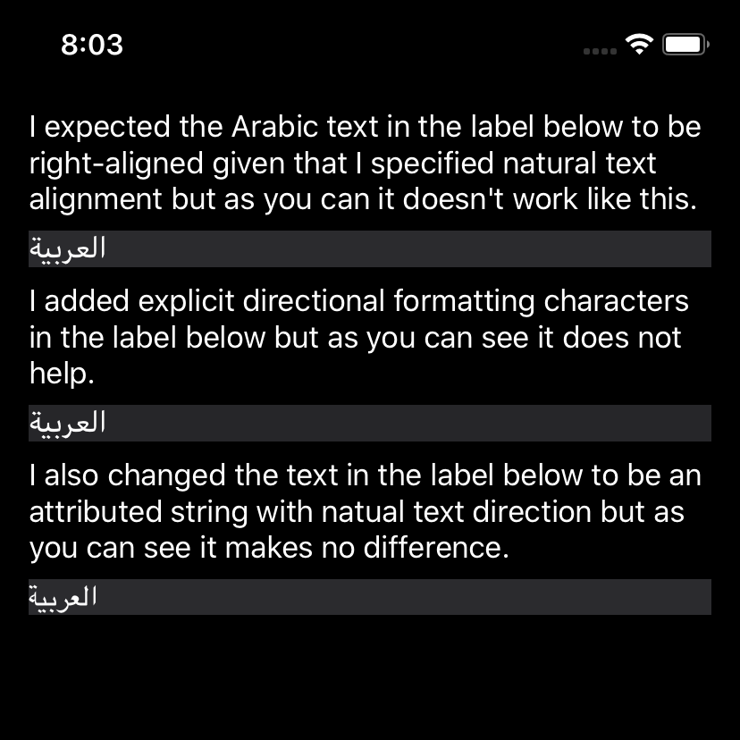
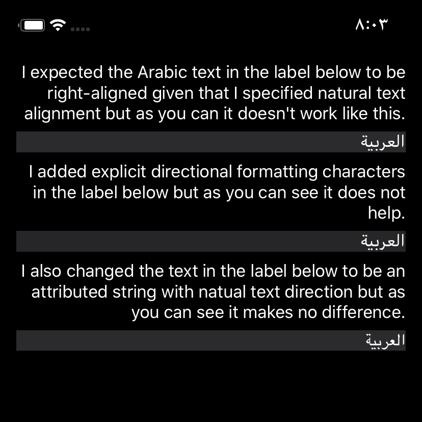

This repository contains a simple iOS application which demonstrates what it means for a [UILabel](https://developer.apple.com/documentation/uikit/uilabel) which specifies natural text alignment (i.e. a [textAlignment](https://developer.apple.com/documentation/uikit/uilabel/1620541-textalignment) value of [NSTextAlignment.natural](https://developer.apple.com/documentation/uikit/nstextalignment/natural)) to contain right-to-left text (e.g. Arabic, Hebrew).

The screenshot below demonstrates what you'll see if you run the application on an iOS 13 device which is set to the English language.

Coming from an Android development background I expected the [UILabel](https://developer.apple.com/documentation/uikit/uilabel) objects to left-align the English text and right-align the Arabic text. But it turns out this is not what "natural text alignment" means in iOS.

Instead it turns out that "natural text alignment" in iOS is to left-align or right-align text based on the language of the device. So if your device language is set to English for example you'll get behaviour as in the screenshot above. And if your device language is set to Arabic or Hebrew you'll get behaviour as in the screenshot below.

It's certainly not what I expected but I guess I'll have to get used to it because it's the Apple way 🤷‍♂️
